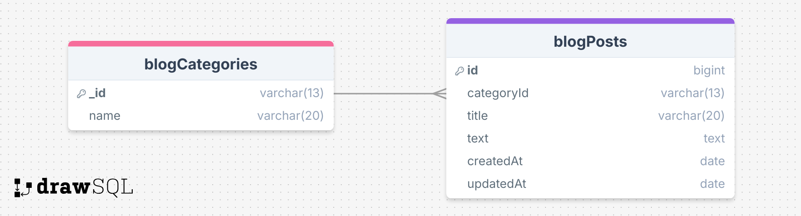

# BLOG Project with Mongoose

## MONGOOSE

https://mongoosejs.com/

### What? Why?


## BLOG API

### ERD:



### Folder/File Structure:

```
    .env
    .gitignore
    index.js
    package.json
    readme.md
    src/
        dbConnection.js
        middlewares/
            errorHandler.js
        models/
            blogModel.js
        controllers/
            blogController.js
        routes/
            blogRouter.js
```